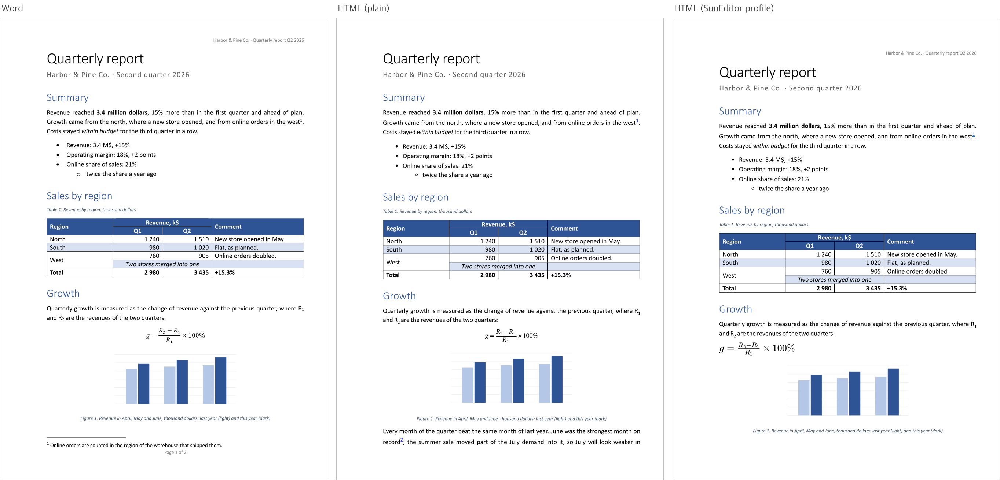
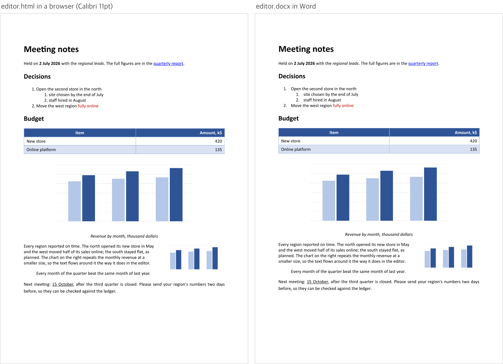

# kovami/htmldocx

[](https://github.com/kovami/htmldocx/actions/workflows/ci.yml)
[](https://packagist.org/packages/kovami/htmldocx)
[](https://packagist.org/packages/kovami/htmldocx)
[](LICENSE)

[English](README.md) · **Русский**

Превращает HTML в документы Word и документы Word обратно в HTML — одной библиотекой, без зависимостей в рантайме и без Word, LibreOffice или headless-браузера где-либо поблизости.

```php
use Kovami\HtmlDocx\HtmlDocx;

$docx = HtmlDocx::plain()->fromHtml('<h1>Отчёт</h1><p>Привет, <b>мир</b></p>')->toDocx();
$html = HtmlDocx::plain()->fromDocx($docx)->toHtml();
```

HTML на выходе самодостаточен: каждый абзац несёт свой шрифт, размер, цвет, отступы и межстрочный интервал — документ выглядит собой где угодно. Если у вас есть редактор, возьмите его диалект:

```php
use Kovami\HtmlDocx\Editor;

$html = HtmlDocx::for(Editor::CKEditor)->fromDocxFile('report.docx')->toHtml();
```

Оба направления сходятся посередине — в одной модели документа:

```
HTML ──разбор──► каскад CSS ──► модель документа ──► OOXML ──► .docx
.docx ──► OOXML ──разрешение стилей──► модель документа ──► HTML
```

Именно общая модель и позволяет документу съездить в Word и вернуться похожим на себя — см. [Круговые преобразования](#круговые-преобразования).

## Содержание

- [Требования](#требования)
- [Установка](#установка)
- [Использование](#использование)
- [Профили](#профили)
- [Насколько похоже](#насколько-похоже)
- [Опции](#опции)
- [Изображения](#изображения)
- [Предупреждения](#предупреждения)
- [Подключение в приложении](#подключение-в-приложении)
- [Что умеет](#что-умеет)
- [Чего не умеет](#чего-не-умеет)
- [Круговые преобразования](#круговые-преобразования)
- [Безопасность](#безопасность)
- [Переход с 1.x](#переход-с-1x)
- [Участие в разработке](#участие-в-разработке)
- [Лицензия](#лицензия)

## Требования

- PHP 8.4 или новее (со стороны HTML используется штатный HTML5-парсер `Dom\HTMLDocument`)
- `ext-dom`, `ext-mbstring`, `ext-xmlwriter`, `ext-zlib`
- `ext-gd` — по желанию: с ним изображения WebP конвертируются в PNG, который Word умеет показывать; без него они пропускаются
- Никаких зависимостей Composer в рантайме

## Установка

```bash
composer require kovami/htmldocx
```

## Использование

### HTML в DOCX

```php
use Kovami\HtmlDocx\Config\PageLayout;
use Kovami\HtmlDocx\HtmlDocx;
use Kovami\HtmlDocx\Options;

$converter = HtmlDocx::plain(new Options(
    language: 'ru-RU',
    pageLayout: PageLayout::a4Portrait(marginCm: 2.0),
));

$bytes = $converter->fromHtml($html)->toDocx();          // .docx строкой
$converter->fromHtml($html)->saveDocx('/tmp/out.docx');  // сразу в файл
$converter->fromHtml($html)->streamDocx($stream);        // сразу в поток
$converter->fromHtmlFile('/tmp/in.html')->toDocx();      // из файла
```

У размера бумаги нет HTML-эквивалента, поэтому он задаётся настройками — один раз через `Options` или на конкретный вызов:

```php
$converter->fromHtml($html, PageLayout::a4Landscape())->toDocx();
```

### DOCX в HTML

```php
$html = $converter->fromDocx($bytes)->toHtml();
$html = $converter->fromDocxFile('/tmp/report.docx')->toHtml();
$html = $converter->fromDocxStream($stream)->toHtml();
$converter->fromDocxFile('/tmp/report.docx')->saveHtml('/tmp/report.html');
```

По умолчанию получается фрагмент (без `<html>` и `<body>`), готовый к вставке на страницу или в редактор. Когда нужен целый документ:

```php
$html = HtmlDocx::plain(new Options(fullHtmlDocument: true))->fromDocxFile('/tmp/report.docx')->toHtml();
```

Источник (`fromHtml`, `fromHtmlFile`, `fromDocx`, `fromDocxFile`, `fromDocxStream`, `fromDocument`) возвращает `Conversion`: документ читается один раз, а дальше у него можно просить что угодно — `toHtml()`, `saveHtml()`, `toDocx()`, `saveDocx()`, `streamDocx()`, `document()`.

### Работа с моделью напрямую

Любое преобразование — это чтение и запись, и между ними можно остановиться: чтобы посмотреть документ, изменить его или собрать с нуля.

```php
$document = $converter->fromDocx($bytes)->document();   // .docx → Kovami\HtmlDocx\Model\Document
$document = $converter->fromHtml($html)->document();    // HTML  → Document

$converter->fromDocument($document)->toDocx();          // Document → байты .docx
$converter->fromDocument($document)->toHtml();          // Document → HTML
```

Модель — обычные PHP-объекты: `Document` хранит список блоков `Paragraph` и `Table`, абзацы — инлайны `TextRun`, `ImageRun`, `Hyperlink`, `Formula`, `NoteReference`, `BreakRun`, `TabRun` и `Bookmark`, и каждый из них несёт полностью вычисленное форматирование — никаких стилей доискивать уже не нужно.

### Экземпляры неизменяемы

Конвертер можно создать один раз и переиспользовать для любого числа документов. Методы `with*` возвращают новый экземпляр:

```php
$converter = HtmlDocx::plain()
    ->withOptions(new Options(language: 'de-DE'))
    ->withLocalImageBaseDir(__DIR__.'/public')
    ->withWarningHandler(static fn (string $message) => Log::info($message));
```

## Профили

Редакторы расходятся в разметке: одному нужен `<figure>` вокруг картинки, другому `<div>`; один хранит MathML, другой — свой span. Профиль решает, какой диалект HTML писать, и заодно учит читателя идиомам этого редактора и типографике, которой тот показывает текст.

```php
HtmlDocx::plain();                   // стандартный HTML, для любого редактора и без него
HtmlDocx::for(Editor::CKEditor);     // CKEditor 5
HtmlDocx::for(Editor::TinyMce);      // TinyMCE
HtmlDocx::for(Editor::TipTap);       // TipTap / ProseMirror
HtmlDocx::for(Editor::SunEditor);    // SunEditor
HtmlDocx::for('tinymce');            // по имени, регистр не важен, синонимы тоже
```

Каким бы профилем ни писался HTML, **читатель понимает все**: HTML от любого из этих редакторов (и вывод 1.x этой библиотеки) правильно читается любым профилем.

| | plain | CKEditor | TinyMCE | TipTap | SunEditor |
| --- | --- | --- | --- | --- | --- |
| Текст, списки, таблицы, картинки, ссылки | ✓ | ✓ | ✓ | ✓ | ✓ |
| Сноски и концевые сноски | ✓ `<section class="footnotes">` | ✓ | ✓ | частично¹ | ✓ `se-footnotes` |
| Формулы | ✓ MathML | ✓ `\(…\)` | ✓ `\(…\)` | ✓ inline-math | ✓ span KaTeX |
| Колонтитулы | — отбрасываются с предупреждением | — | — | — | ✓ `se-header` / `se-footer` |
| Комментарии | — отбрасываются с предупреждением | — | — | — | ✓ `se-comment` |
| Поля номеров страниц | — становятся текстом | — | — | — | ✓ `se-field` |

¹ Сноски записываются, но схема TipTap сохраняет только их текст: сам раздел и ссылки обратно круг через него не переживают.

**Базовая типографика.** Текст, у которого нет своего форматирования, каждый редактор показывает шрифтом из своего content-стиля — профиль исходит ровно из него, поэтому документ, набранный в редакторе, в Word выглядит так же: у CKEditor это Helvetica браузерного размера medium с интервалом 1.5, у TinyMCE — системный шрифт с 1.4, у SunEditor — Helvetica Neue 13px цветом #333. Для plain HTML это Calibri 11pt. Стек TinyMCE начинается с «системного шрифта этой платформы», а DOCX так попросить не может: Word получает Segoe UI — его и показывает Windows, — тогда как macOS показывает San Francisco с другими метриками, и текст там выходит длиннее или короче. Если приложение оформляет редактор иначе — а так обычно и есть — или его пользователи на Mac, скажите об этом:

```php
new Options(fontFamily: 'Times New Roman', fontSizePt: 12.0, textColor: '222222');
new Options(extraStylesheet: 'body { font-family: Georgia; } p { margin: 0 0 12px; }');
```

**Настройка редактора.** Редакторы выбрасывают всё, чего нет в их схеме: из коробки CKEditor, TipTap и SunEditor сохраняют около трети написанного библиотекой форматирования (TinyMCE — почти всё). С плагинами и белыми списками ниже они сохраняют 98–99,7%, и то, что они отдают обратно, печатается с 75–81% краски на своём месте. Точные конфигурации, на которых считается бенч, лежат в [`bench/fidelity/editors`](bench/fidelity/editors).

| Редактор | Что ему нужно |
| --- | --- |
| CKEditor 5 | Плагин `GeneralHtmlSupport`, разрешающий любые элементы со стилями, классами и атрибутами: `htmlSupport: { allow: [{ name: /.*/, styles: true, classes: true, attributes: true }] }`, рядом с плагинами таблиц, списков, картинок, ссылок, цитат и блоков кода |
| TinyMCE | Плагины `lists`, `advlist`, `table`, `link` и `image`; остальную разметку он сохраняет как есть |
| TipTap | `StarterKit` вместе с `TableKit`, `TextStyleKit`, `TextAlign`, `Image` (`inline: true`, `allowBase64: true`), `Subscript`, `Superscript`, `Highlight`, `Mathematics` — и расширение, которое сохраняет `style` и `id` у блоков (`addGlobalAttributes`): без него TipTap их выбрасывает |
| SunEditor | Все его плагины вместе с KaTeX, плюс `attributesWhitelist: { all: 'style|id|role|start|value|data-.+' }` и `addTagsWhitelist: 'section|colgroup|col'` |

## Насколько похоже

В репозитории лежит бенч, который отвечает на этот вопрос числами, а не прилагательными ([`bench/fidelity`](bench/fidelity), macOS с Microsoft Word):

- **DOCX → HTML**: Word печатает документ, Chromium печатает HTML библиотеки на той же бумаге, и страницы сравниваются попиксельно — какая доля краски с каждой стороны имеет краску с другой в пределах 1.33 pt, плюс куда попало каждое слово.
- **HTML → DOCX**: обратно. HTML редактора показывается в браузере с его же content-стилем и сравнивается с тем, как Word печатает DOCX, сделанный библиотекой из этого HTML.

| DOCX → HTML, plain HTML | Только текст | Вся страница |
| --- | --- | --- |
| Краска на месте | **96,5%** | 81,0% |
| Слов на своей странице | **100%** | 100% |
| Медианный вертикальный сдвиг | **0,5 pt** | — |

«Только текст» — без колонтитулов и сносок: они расходятся по замыслу. В plain HTML нет страничной обвязки, а сноски браузер печатает в конце, тогда как Word — внизу страницы.

Лучше посмотреть, чем читать: [примеры](https://kovami.github.io/htmldocx/) — это отчёт, написанный Word, HTML, который делает из него библиотека, DOCX, который она делает из редакторского HTML, и постраничные картинки рядом с печатью самого Word.

| | |
| --- | --- |
| Word, plain HTML и профиль SunEditor рядом | [](https://kovami.github.io/htmldocx/images/showcase-p1.png) |
| Редакторский HTML в браузере и сделанный из него DOCX в Word | [](https://kovami.github.io/htmldocx/images/editor-p1.png) |

## Опции

Один объект `Options` настраивает оба направления. Первый блок описывает окружение, в котором живёт документ: шрифт, размер и цвет, к которым текст откатывается, и таблицу стилей, относительно которой читается HTML.

| Опция | По умолчанию | Направление | Что делает |
| --- | --- | --- | --- |
| `fontFamily` | из профиля | оба | Базовый шрифт текста, у которого нет своего форматирования ([Профили](#профили)) |
| `fontSizePt` | из профиля | оба | Базовый размер, в пунктах |
| `textColor` | из профиля | оба | Базовый цвет, `RRGGBB` |
| `language` | `null` | HTML → DOCX | Язык проверки правописания в документе, например `ru-RU` |
| `pageLayout` | A4 книжная | HTML → DOCX | Размер бумаги, ориентация и поля |
| `defaultStylesheet` | из профиля | оба | Заменяет встроенные умолчания: content-стиль редактора для его профиля, браузерный — для plain HTML |
| `extraStylesheet` | `''` | оба | CSS поверх умолчаний и под собственным `<style>` документа |
| `title`, `author` | `null` | HTML → DOCX | Свойства документа (заголовок берётся из `<title>`, если не задан) |
| `createdAt` | сейчас | HTML → DOCX | Фиксированная метка времени — для побайтово воспроизводимого результата |
| `cssUnit` | `px` | DOCX → HTML | Единица длин и размеров шрифта: `px` или `pt` |
| `includeHiddenText` | `false` | DOCX → HTML | Сохранять текст, помеченный в Word как скрытый |
| `includeHeadersFooters` | `true` | DOCX → HTML | Сохранять колонтитулы |
| `includeComments` | `true` | DOCX → HTML | Сохранять комментарии рецензентов и текст, к которому они привязаны |
| `idPrefix` | `''` | DOCX → HTML | Префикс для генерируемых id (закладки, сноски), чтобы несколько документов уживались на одной странице |
| `fullHtmlDocument` | `false` | DOCX → HTML | Обернуть фрагмент в `<html><head>…<body>` |
| `maxDocxEntryBytes` | 128 МБ | DOCX → HTML | Предел распакованного размера одной части пакета |
| `maxDocxTotalBytes` | 512 МБ | DOCX → HTML | Предел распакованного размера всего пакета |

`Options` неизменяем; `with()` создаёт копию с изменениями:

```php
$options = (new Options(fontFamily: 'Georgia'))->with(['cssUnit' => 'pt', 'idPrefix' => 'doc1-']);
```

Каждый блок HTML, который пишет библиотека, несёт собственное форматирование — каким бы профилем он ни был написан, — поэтому документ выглядит собой и в редакторе, и в письме, и на странице с чужими стилями.

## Изображения

**В документ.** Значения `` разрешает `ImageSourceResolver`. Из коробки работают `data:`-URI и больше ничего: конвертер не ходит в сеть и не читает диск, пока вы этого не разрешите.

```php
$converter = HtmlDocx::plain()
    // относительные пути разрешаются только внутри этой папки, выше — никогда
    ->withLocalImageBaseDir(public_path())
    // http(s)-картинки идут через ваш загрузчик, где живут ваши таймауты и белый список
    ->withRemoteImages(fn (string $url): ?string => Http::timeout(5)->get($url)->body());
```

Свой `ImageSourceResolver` позволит брать картинки из объектного хранилища, CDN или базы. PNG, JPEG, GIF, BMP и TIFF встраиваются как есть; WebP конвертируется в PNG, если доступен `ext-gd`; остальное пропускается (с предупреждением). Изображения масштабируются по CSS-размерам `width`/`height`, сохраняют пропорции, если задан только один из них, и ограничиваются шириной текстовой колонки.

**Из документа.** Картинки, найденные в `.docx`, размещает `ImageHandler`. По умолчанию они встраиваются как data-URI; можно отдать их своему хранилищу:

```php
use Kovami\HtmlDocx\Image\CallbackImageHandler;
use Kovami\HtmlDocx\Model\ImageData;

$converter = HtmlDocx::plain()->withImageHandler(new CallbackImageHandler(
    function (ImageData $image, string $description): ?string {
        Storage::put($path = "media/{$image->hash()}.{$image->extension}", $image->bytes);

        return Storage::url($path);   // либо null, чтобы не вставлять картинку
    },
));
```

`$image->bytes` берутся из документа, поэтому доверять им нельзя. До обработчика доходят только картинки, опознанные по сигнатуре (PNG, JPEG, GIF, BMP, TIFF, WebP в виде PNG); SVG, который может нести скрипты, и метафайлы Windows пропускаются с предупреждением. Сохраняйте файл с тем `extension`, который даёт библиотека, отдавайте его с её `contentType` и заголовком `X-Content-Type-Options: nosniff`, а лучше — с отдельного домена, чтобы файл, отданный не с тем типом, никогда не стал страницей вашего сайта.

## Предупреждения

Всё, что документ несёт, а преобразование выразить не может, сообщается, а не выбрасывается молча:

```php
$converter = HtmlDocx::plain()->withWarningHandler(function (string $message): void {
    Log::notice("htmldocx: {$message}");
});
```

Так вы узнаете про встроенное содержимое чужого формата, картинки с недоступными или нечитаемыми данными и части пакета, которые не удалось разобрать.

## Подключение в приложении

Библиотека ничего не знает про фреймворки: это несколько обычных классов без зависимостей и без глобального состояния, поэтому подключение — несколько строк там, где ваше приложение собирает сервисы. Конвертер неизменяем и безопасен для переиспользования: создайте один и держите.

```php
// Laravel — app/Providers/AppServiceProvider.php
use Kovami\HtmlDocx\Config\PageLayout;
use Kovami\HtmlDocx\Editor;
use Kovami\HtmlDocx\HtmlDocx;
use Kovami\HtmlDocx\Options;

$this->app->singleton(HtmlDocx::class, fn (): HtmlDocx => HtmlDocx::for(Editor::CKEditor, new Options(
    fontFamily: config('documents.font_family'),
    fontSizePt: config('documents.font_size_pt'),
    language: config('app.locale'),
    pageLayout: PageLayout::fromArray(config('documents.page', [])),
))
    ->withLocalImageBaseDir(public_path())
    ->withWarningHandler(static fn (string $message) => Log::notice("htmldocx: {$message}")));
```

`PageLayout::fromArray()` принимает ровно такую форму, в какой бумагу обычно и держат в конфиге:

```php
PageLayout::fromArray(['size' => 'a4', 'orientation' => 'landscape', 'margin_cm' => 1.5]);
```

В Symfony конвертер собирает фабрика — с тем же контролем, что и выше:

```yaml
# config/services.yaml
Kovami\HtmlDocx\HtmlDocx:
    factory: ['App\Documents\ConverterFactory', 'create']   # возвращает HtmlDocx::plain(...) или HtmlDocx::for(...)
```

## Что умеет

### HTML → DOCX

**CSS действительно каскадируется.** Атрибуты `style`, блоки `<style>` внутри документа, настроенные таблицы стилей и презентационные атрибуты (`align`, `width`, `bgcolor`, `border`…) разрешаются так же, как их разрешает браузер: полноценные селекторы через нативный DOM (комбинаторы, селекторы атрибутов, структурные псевдоклассы), специфичность, `!important`, наследование и раскрытие сокращённых записей (`margin`, `padding`, `border`, `background`, `font`, `text-decoration`, `list-style`, логические свойства). Понимаются длины в `px`, `pt`, `pc`, `in`, `cm`, `mm`, `q`, `em`, `rem`, `ex`, `ch` и `%`, а цвета — в hex, `rgb()`, `rgba()`, `hsl()` и по именам.

| Содержимое | Во что превращается в Word |
| --- | --- |
| Абзацы, `div`, `section`, `article`, `blockquote`, `pre`, `address`, … | Абзацы: внешние отступы — в интервалы, внутренние и рамки — в границы абзаца, фон — в заливку |
| `h1`–`h6` | Настоящие стили *Заголовок 1–6*, поэтому работают область навигации и оглавление |
| `b`, `strong`, `i`, `em`, `u`, `s`, `del`, `sup`, `sub`, `mark`, `small`, `code`, `q`, … | Форматирование знаков: насыщенность, начертание, подчёркивание (вместе с его типом), зачёркивание, положение, цвет, выделение, шрифт, размер, межбуквенный интервал, прописные и капитель |
| `ul`, `ol`, вложенные списки | Настоящая нумерация Word: маркеры по уровням, `start`, `value`, `reversed` и `list-style-type` — включая те counter styles, которых в Word нет: они выписываются буквальными маркерами |
| `table` с `thead`/`tbody`/`tfoot`, `caption`, `colgroup` | Таблицы с сеткой колонок, повторяющимися строками заголовка, `colspan`/`rowspan`, границами, заливкой, полями и выравниванием ячеек, фиксированными и процентными ширинами |
| `img` | Встроенные изображения, масштабированные по CSS-размеру |
| `a href` | Гиперссылки; `href="#id"` превращается в ссылку на закладку, а закладками становятся только те id, на которые кто-то ссылается |
| `br`, `hr`, табуляции | Разрывы строк, абзац-линейка с рамкой, символы табуляции |
| `page-break-before` / `page-break-after` | Разрывы страниц |
| MathML, `\(…\)` и `\[…\]`, узлы формул TipTap, span KaTeX от SunEditor | **Office Math** — формула переводится в ту, которую Word верстает и умеет редактировать |
| `<section class="footnotes">` / `endnotes` и надстрочные ссылки на них (а также `se-footnotes` от SunEditor) | Настоящие сноски и концевые сноски: то, что библиотека вывела в HTML, возвращается сносками |
| `<div class="se-header">` / `se-footer`, с `data-type="first"` или `"even"` | Колонтитулы, в том числе особые для первой и для чётных страниц |
| `<span class="se-field" data-field="PAGE">` / `NUMPAGES` | Поля номера страницы и числа страниц, которые Word пересчитывает сам |
| `<span class="se-comment" data-comment="1 2">` и `<ol class="se-comments">` | Комментарии к отмеченному тексту — диапазоны могут пересекать абзацы и накладываться друг на друга — с автором, инициалами, датой, ответами и отметкой «решено» |
| `iframe`, `video`, `audio`, `embed`, `object` | Ссылка на источник: проигрывать их Word не умеет |
| `input` | Флажки и переключатели как ☑ / ☐, остальные поля — своим значением |
| `dir="rtl"`, `direction` | Абзацы с написанием справа налево |
| `<title>` | Заголовок документа |
| `float: left` / `right` у картинки | Картинка, привязанная к этому краю колонки, с обтеканием текстом |

Пробельные символы обрабатываются по правилам CSS — схлопывание, `pre`, `pre-wrap`, `pre-line`, `nowrap`, — а `text-transform`, отступ первой строки, `line-height` (множителем или фиксированной высотой) и `text-align` (включая `justify`) переносятся как есть. Кривая вёрстка разбирается так же, как её разбирает браузер, — потому что разбирается таким же парсером.

### DOCX → HTML

Форматирование вычисляется так же, как его вычисляет Word: умолчания документа, цепочки наследования стилей, уровни нумерации, стили таблиц и прямое форматирование — каждый слой в своём порядке, — а затем записывается в HTML, который показывает то же самое и без внешней таблицы стилей. Строки ниже описывают plain HTML; профиль пишет то же содержимое на диалекте своего редактора ([Профили](#профили)).

| Содержимое | Во что превращается в HTML |
| --- | --- |
| Абзацы и их стили | `<p>`, либо `<h1>`–`<h6>`, если у абзаца задан уровень структуры; интервалы, отступы, выравнивание, рамки, заливка и межстрочный интервал — инлайновыми стилями |
| Форматирование знаков | `<strong>`, `<em>`, `<u>`, `<del>`, `<sup>`, `<sub>` внутри `<span>` со шрифтом, размером, цветом и выделением |
| Шрифты и цвета темы | Разрешаются через `theme1.xml`, включая осветление и затемнение |
| Нумерация | Настоящая вложенность `<ul>`/`<ol>`, `start` и `value`, CSS-стили счётчиков там, где они подходят, и точный текст маркера там, где не подходят (`1.2.`, `A)`, `α.`) |
| Таблицы | `<table>` с `<colgroup>`, `<thead>`, `rowspan`/`colspan` и форматированием, которое диктует стиль таблицы: строки заголовка, чередование строк, первый и последний столбец, угловые ячейки |
| Изображения | `` со своим размером — одна в абзаце или внутри строки; обтекаемая сохраняет `float` и обтекание. Профиль SunEditor заворачивает её в свой компонент, который его панель умеет выделять и масштабировать |
| Сноски и концевые сноски | Надстрочные ссылки на `<section class="footnotes">` / `endnotes` в конце (с ролями DPUB-ARIA), со ссылками обратно к месту в тексте |
| Колонтитулы | Сохраняет только профиль SunEditor: `<div class="se-header">` перед содержимым и `<div class="se-footer">` после него; у вариантов для первой и чётных страниц есть `data-type`. Берутся те, что показывает последний раздел, с наследованием между разделами, как в Word |
| Номера страниц | `<span class="se-field" data-field="PAGE">` (профиль SunEditor) или текстом то число, которое Word показал последним |
| Комментарии | Сохраняет только профиль SunEditor: текст, к которому относится комментарий, обёрнут в `<span class="se-comment" data-comment="…">` (через пробел — все комментарии, которые его покрывают), а после сносок идёт `<ol class="se-comments">`: по `li` на комментарий с `data-author`, `data-initials`, `data-date`, `data-parent` у ответа и `data-resolved` |
| Гиперссылки и закладки | `<a href>` и `<a id>`, включая поля перекрёстных ссылок и `HYPERLINK` |
| Поля | Их текущий результат (даты, ссылки, флажки форм); номера страниц остаются полями |
| Исправления | Показываются принятыми: вставки остаются, удаления и перенесённый текст убираются |
| Office Math | MathML с LaTeX в аннотации — или в том виде, который читает редактор профиля |
| Надписи и фигуры | Их текст — абзацами следом за тем, к которому они привязаны |
| Символы и дингбаты | Переводятся в настоящие символы Unicode |
| Разрывы строк и страниц, табуляции | `<br>`, `page-break-before`, сохранённые пробелы |
| Геометрия раздела | Размер страницы и поля — как ширина, по которой раскладывается содержимое |

Элементы управления содержимым, смарт-теги и обёртки альтернативного содержимого прозрачны: то, что внутри, читается как обычно.

## Чего не умеет

Прямо сказать полезнее, чем длинный список возможностей, поэтому:

- **Колонтитулы берутся только из последнего раздела**: если у разделов они разные, в результате будут колонтитулы последнего.
- **Исправления схлопываются**, а не сохраняются как правки: вы получаете документ так, будто все изменения приняты.
- **Диаграммы, SmartArt и OLE-объекты** доходят только картинкой, которую Word хранит рядом с ними; живой объект теряется.
- **`w:altChunk`** (встроенные внутрь `.docx` HTML или RTF) пропускается, с предупреждением.
- **Макросы, данные форм и привязки элементов управления** не переносятся.
- **Раскладка вордовская, а не браузерная.** Flexbox, grid, многоколоночная вёрстка, абсолютное позиционирование и перекрытия в текстовом процессоре эквивалента не имеют: блочные боксы становятся абзацами, а их отступы, интервалы, рамки и фон сохраняются. Плавающая картинка становится привязанной, с обтеканием текстом; плавающий текст — нет.
- **Внешние таблицы стилей не загружаются.** В каскаде участвуют только блоки `<style>` внутри документа и те стили, что вы настроили. Блоки `@media` и `@supports` читаются, когда относятся к печати; `<style media="screen">` пропускается.
- **Ни скриптов, ни SVG, ни canvas.** `script`, `svg`, `canvas`, `select`, `textarea` и `button` игнорируются.
- **Старый двоичный `.doc`**, RTF, ODT и PDF — вне области задач, в обе стороны.
- **Шрифты не встраиваются**, а текст не измеряется: разбиение на страницы — дело Word, поэтому число страниц и место разрыва здесь неизвестны.
- **HTML на выходе — фрагмент содержимого**, а не постраничное представление документа.

Несколько расхождений — это спор двух движков, а не потеря при преобразовании; именно из-за них бенч выше не показывает 100%:

- рамку тоньше пикселя браузер рисует целым пикселем, отчего каждая строка таблицы на доли пункта выше вордовской;
- маркер списка CSS ставит рядом с текстом, а Word — на выступе;
- редактор, который не моделирует какое-то форматирование, выбрасывает его ещё до библиотеки: TipTap не хранит `style` у картинок (проценты ширины, обтекание) и межбуквенный интервал, TinyMCE — табуляции внутри блоков кода.

## Круговые преобразования

HTML-писатель выписывает только то, что отличается от таблицы стилей, относительно которой этот HTML потом будут читать, а HTML-читатель разрешает ту же самую таблицу стилей — поэтому документ переживает круг, а не обрастает разметкой. Конкретно:

- `HTML → DOCX → HTML` устойчив после первого прохода: преобразуйте результат ещё раз — получите те же байты.
- `DOCX → HTML → DOCX` сохраняет структуру, форматирование, нумерацию, таблицы, изображения, ссылки, сноски, колонтитулы и комментарии.
- Судья — сам Word: документ, записанный здесь, открывается в Word без предложения его восстановить, а если прочитать документ Word, пересохранить его в самом Word и прочитать снова, результат будет тем же.

Вертикальные интервалы устроены как в Word: между двумя абзацами он оставляет больший из интервала после первого и интервала перед вторым — ровно так же схлопываются поля в CSS, поэтому промежутки, которые вы видите в браузере, это те же промежутки, которые напечатает Word.

## Безопасность

Документы приходят от пользователей, поэтому читатель относится к ним как к враждебному вводу:

- Распакованный размер ограничен и для отдельной части, и для всего пакета (`maxDocxEntryBytes`, `maxDocxTotalBytes`), количество записей ограничено, а распаковка останавливается на размере, который запись сама и объявила, — zip-бомбе не хватит места раньше, чем памяти.
- Часть, объявляющая `DOCTYPE`, отвергается сразу: в OOXML его не бывает, так что атаке на раскрытие сущностей не с чего начать, а сети у парсера нет. Части в UTF-16 перед проверкой декодируются, а любая другая кодировка, в которой его можно спрятать, отвергается.
- Всё, что документ кладёт в атрибут `style`, — имена шрифтов, маркеры списков — записывается как правильно экранированная CSS-строка, так что значение не может закрыть своё объявление и добавить новое.
- Цели связей, указывающие за пределы пакета, считаются отсутствующими.
- URL со схемами `javascript:`, `vbscript:`, `data:` и `file:` убираются из гиперссылок в обе стороны (с `src` изображения всё иначе: `data:` — это как раз то, чем картинки и путешествуют).
- Локальные картинки читаются только внутри названной вами папки, удалённые — только через написанный вами загрузчик.
- Картинки передаются дальше только в растровых форматах, опознанных по байтам; SVG не передаётся никогда (см. [Изображения](#изображения)).
- Формулы записываются как LaTeX, который отрисовывает редактор. Если вы отрисовываете их KaTeX, оставьте его настройку по умолчанию `trust: false`, чтобы `\href`, `\url` и `\htmlClass` из документа не превращались в ссылки и разметку.
- Всё, чему в документе доверять нельзя, — символы, которые XML не переносит, битые части, оборванные связи — вычищается или пропускается, а не проходит насквозь.

Ошибки, останавливающие преобразование, выбрасываются как `Kovami\HtmlDocx\Exceptions\HtmlDocxException`.

## Переход с 1.x

Методов 1.x больше нет: конвертер выбирается через `plain()` или `for()`, источник читается один раз, а результат спрашивается у возвращённого `Conversion`.

| 1.x | 2.0 |
| --- | --- |
| `new HtmlDocx($options)` | `HtmlDocx::plain($options)` — или `HtmlDocx::for(Editor::SunEditor, $options)` ради разметки 1.x |
| `$c->htmlToDocx($html)` | `$c->fromHtml($html)->toDocx()` |
| `$c->htmlToDocxFile($html, $path)` | `$c->fromHtml($html)->saveDocx($path)` |
| `$c->htmlToDocxStream($html, $stream)` | `$c->fromHtml($html)->streamDocx($stream)` |
| `$c->docxToHtml($bytes)` | `$c->fromDocx($bytes)->toHtml()` |
| `$c->docxFileToHtml($path)` | `$c->fromDocxFile($path)->toHtml()` |
| `$c->docxStreamToHtml($stream)` | `$c->fromDocxStream($stream)->toHtml()` |
| `$c->readDocx($bytes)` | `$c->fromDocx($bytes)->document()` |
| `$c->readHtml($html)` | `$c->fromHtml($html)->document()` |
| `$c->writeDocx($document)` | `$c->fromDocument($document)->toDocx()` |
| `$c->writeDocxToStream($document, $stream)` | `$c->fromDocument($document)->streamDocx($stream)` |
| `$c->writeHtml($document)` | `$c->fromDocument($document)->toHtml()` |

Изменилось ещё два:

- **HTML стал самодостаточным.** Каждый блок выписывает свой шрифт, размер, цвет, поля и межстрочный интервал вместо того, чтобы опираться на таблицу стилей редактора, — и выглядит правильно где угодно. Опция `Options::$keepDocumentDefaults`, которая выбирала между этими двумя способами, удалена.
- **`Options::$fontFamily`, `$fontSizePt` и `$textColor` по умолчанию берутся из типографики профиля**, а не равны Calibri 11pt. Передайте их, чтобы вернуть прежнюю базу или совпасть с CSS своего редактора.

`HtmlDocx::for(Editor::SunEditor)` пишет ту же разметку, что писала 1.x, и читатель любого профиля её понимает — сохранённый HTML продолжает работать.

## Участие в разработке

См. [CONTRIBUTING.md](CONTRIBUTING.md).

## Лицензия

MIT — см. [LICENSE](LICENSE). Сторонний код перечислен в [THIRD-PARTY-NOTICES.md](THIRD-PARTY-NOTICES.md).
